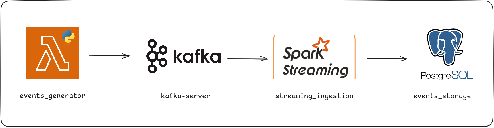

# Boas vindas ao **streaming_system**!

O objetivo deste projeto é simular um sistema de ingestão de eventos em tempo real, integrando o **Apache Kafka** como serviço de mensageria e o storage dos eventos com **PostgresSQL** através do **Apache Spark**.

> **IMPORTANTE: Todos os cenários consideram a execução do projeto à partir da raiz do projeto.
>  Logo após cloná-lo abra a pasta resultado em seu terminal:**
  >  ```bash
  >  cd streaming_system
  >  ```

# <a id='topicos'>Tópicos</a>
- [Desenho do sistema](#design)
- [Executando projeto](#executing)
  - [Iniciando os serviços](#starting)
  - [Evoluindo o sistema](#evolving)
  - [Acessando mensageria](#kafka)
  - [Acessando banco de dados](#sql)
  - [Acompanhando ingestão](#ingestion)


## <a id='design'>[Desenho do sistema](#topicos)</a>



São quatro serviços executando em conjunto:

- **event_generator**: Gera eventos aleatórios e os envia para o tópico **app-events** no **Apache Kafka** `a cada 5 segundos`.
- **kafka-server**: Servidor **Apache Kafka** que armazena o tópico **app-events**.
- **streaming_ingestion**: Serviço **Apache Spark** que consome os eventos do tópico **app-events**, com as soluções `streaming` do motor, e os armazena no banco de dados **events_storage** `a cada minuto`.
- **events_storage**: Banco de dados **PostgresSQL** que armazena os eventos recebidos nas seguintes entidades:
  - **event_counts**: Contagem de eventos por tipo na janela de tempo.
  - **user_event_counts**: Contagem de eventos por usuário na janela de tempo.
  - **user_avg_waiting_time**: Tempo médio de espera dos últimos 3 minutos por usuário na janela de tempo.

## <a id='executing'>[Executando projeto](#topicos)</a>

### <a id='starting'>[Iniciando os serviços](#topicos)</a>

Na raiz do projeto, execute o comandos abaixo para os recursos correspondentes `em um terminal shell`:

* **iniciando os serviços:**
```bash
docker-compose up -d # requisito para os recursos abaixo
```

### <a id='evolving'>[Evoluindo o sistema](#topicos)</a>

Para manutenção e evolução do sistema, os seguintes comandos podem ser úteis:

* **removendo recursos do sistema:**
```bash
docker-compose down --rmi all --volumes --remove-orphans
docker system prune -a --volumes -f
```

* **validando remoção:**
```bash
docker ps -a  # Verifica se ainda há containers parados
docker images  # Verifica se ainda há imagens
docker volume ls  # Verifica se ainda há volumes
```

* **removendo se necessário:**
```bash
docker rm -f $(docker ps -aq)  # Remove todos os containers
docker rmi -f $(docker images -q)  # Remove todas as imagens
docker volume rm $(docker volume ls -q)  # Remove todos os volumes
```

* **reconstruindo aplicação forçando pull das imagens:**
```bash
docker-compose build --no-cache
docker-compose up -d
```

### <a id='kafka'>[Acessando mensageria](#topicos)</a>

* **confirmando criação do tópico Kafka:**
```bash
docker exec -it kafka-server /opt/kafka/bin/kafka-topics.sh --list --bootstrap-server kafka-server:9092
```

* **detalhes do tópico:**
```bash
docker exec -it kafka-server /opt/kafka/bin/kafka-topics.sh --describe --topic app-events --bootstrap-server kafka-server:9092
```

* **consumindo mensagens do tópico:**
```bash
docker exec -it kafka-server /opt/kafka/bin/kafka-console-consumer.sh --topic app-events --from-beginning --bootstrap-server kafka-server:9092
```

### <a id='sql'>[Acessando banco de dados](#topicos)</a>

* **acessando o container do banco:**
```bash
docker exec -it events_storage bash
```

* **dentro do container, acessando o banco:**
```bash
psql -U user -d events_storage
```

* **listando tabelas:**
```bash
\dt
```

* **consumindo tabelas: (SQL padrão)**
```sql
SELECT * FROM event_counts;
```

* **sair do banco:**
```bash
\q
```

* **ou sair do container:**
```bash
exit
```

### <a id='ingestion'>[Acompanhando ingestão](#topicos)</a>

* **acompanhando logs do Spark:**
```bash
docker logs -f streaming_ingestion
```

* **acessando Spark UI:**
  * [http://localhost:4040](http://localhost:4040)
  